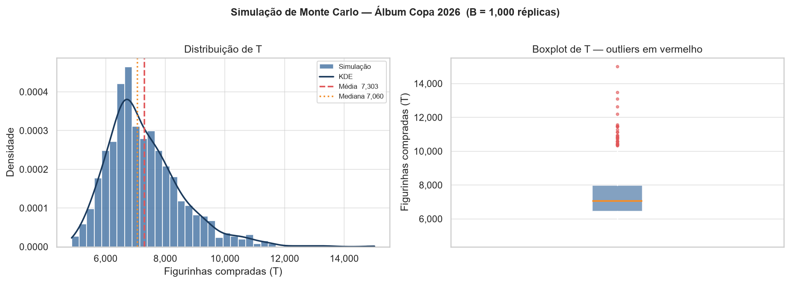
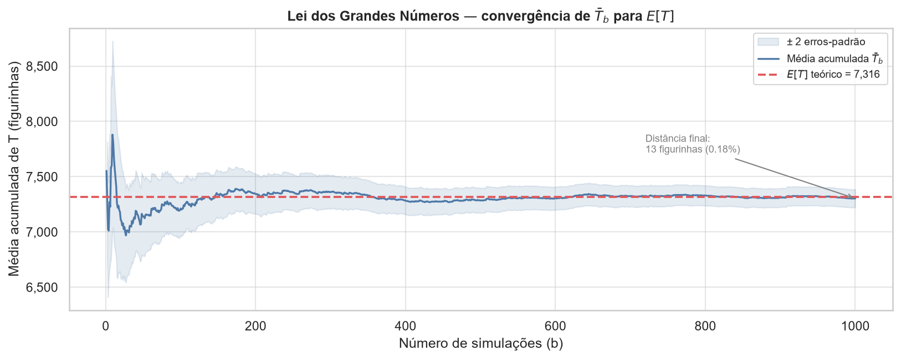

# 🎴 Simulação do Álbum da Copa do Mundo 2026

[](https://www.python.org/)
[](https://jupyter.org/)
[](LICENSE)

Simulação de Monte Carlo do **Problema do Colecionador de Cupons**
aplicado ao álbum oficial da Copa do Mundo FIFA 2026 (980 figurinhas,
pacotes de 7). O projeto quantifica o custo esperado, a variabilidade
e a distribuição completa do número de pacotes necessários para
completar o álbum sem trocas.

---

## Resultados principais

| Métrica | Valor |
|---|---|
| Figurinhas esperadas até completar ($E[T]$) | **7.316** |
| Pacotes esperados ($E[P]$) | **1.046** |
| Custo esperado (R$ 7,00/pacote) | **R$ 7.322,00** |
| Desvio-padrão de $T$ | **~1.285 figurinhas** |
| Figurinhas repetidas esperadas | **6.336 (647% do álbum)** |
| Assimetria ($g_1$) | **1,22 — cauda longa à direita** |

---

## Visualizações

### Distribuição simulada de T e boxplot



### Lei dos Grandes Números — convergência de B̄ₜ para E[T]



---

## Estrutura do projeto

```
copa2026-colecionador-de-cupons/
├── README.md
├── requirements.txt
├── .gitignore
├── notebooks/
│   └── simulacao_album_copa2026.ipynb   # análise completa
├── src/
│   └── simulador.py                     # módulo importável com as funções
└── assets/
    ├── fig_descritiva.png               # histograma + boxplot
    └── fig_lgn.png                      # gráfico da LGN
```

---

## Como reproduzir

```bash
# 1. clone o repositório
git clone https://github.com/LucasVidalFilho/copa2026-colecionador-de-cupons.git
cd copa2026-colecionador-de-cupons

# 2. instale as dependências
pip install -r requirements.txt

# 3. abra o notebook
jupyter notebook notebooks/simulacao_album_copa2026.ipynb
```

Execute `Kernel → Restart & Run All` para reproduzir todos os resultados
com a semente `seed=2026`.

---

## Conceitos abordados

- **Problema do Colecionador de Cupons** — derivação de $E[T] = N \cdot H_N$
  e $Var(T)$ via decomposição em variáveis geométricas independentes
- **Simulação de Monte Carlo** — implementação vetorizada em numpy
  (~28× mais rápida que loop equivalente em Python puro)
- **Lei dos Grandes Números** — convergência de $\bar{T}_b \to E[T]$
  com banda de ±2 erros-padrão ($O(1/\sqrt{b})$)
- **Teorema Central do Limite** — IC 95% para validação formal da
  convergência simulação → teoria
- **Análise descritiva** — assimetria, regra de Tukey, KDE não-paramétrico

---

## Referências

- [ESPN — Álbum Copa 2026: 980 figurinhas e R$ 7,00 por pacote](https://www.espn.com.br/futebol/copa-do-mundo/artigo/_/id/16515251/)
- [Wikipedia — Coupon Collector's Problem](https://en.wikipedia.org/wiki/Coupon_collector%27s_problem)
- Flajolet, P. & Sedgewick, R. *Analytic Combinatorics* (2009), Cap. IV